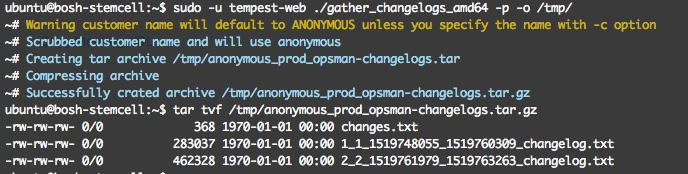
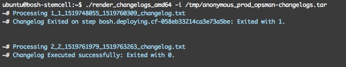

# Changelog Reports

## build

```
./build.sh
```

## usage

```
Usage of ./gather_changelogs:
  -c string
    	Name of customer (default "ANONYMOUS")
  -n	Use this flag if this is a non-prod environment
  -o string
    	defaults to current working director (default "./")
  -p	Use this flag if this is a prod environemnt
```

## Examples

### gathering logs anonymously 

```
sudo -u tempest-web ./gather_changelogs_amd64 -p -o /tmp/
```



### rendering logs 

```
gunzip /tmp/anonymous_prod_opsman-changelogs.tar.gz
```

```
./render_changelogs_amd64 -i /tmp/anonymous_prod_opsman-changelogs.tar
```




